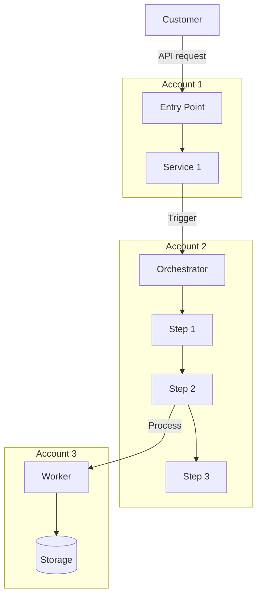

# Feature: [FeatureName]

This document describes the architecture and end-to-end flow for [FeatureName].

> **Related**: Implementation details (state machines, task handlers, error handling) are in `design/workflows/[workflow_name].md`. When updating either document, ensure the other stays consistent.

## Architecture Overview

[One-paragraph description of the feature, what problem it solves, and the high-level approach.]

The account structure includes:
- **[Account 1]** — [Purpose, e.g., Customer-facing APIs and request validation]
- **[Account 2]** — [Purpose, e.g., Workflow orchestration]
- **[Account 3]** — [Purpose, e.g., Data processing and storage]



> Replace with your actual architecture diagram.

## Component Summary

### [Account/Component 1]

- **[Service Name]**: [What it does, how it's deployed, key behaviors. Be specific about compute type, routing, and what APIs it exposes.]

### [Account/Component 2]

- **[Orchestrator Name]**: [What triggers it, what it manages, key resources (queues, state machines, DDB tables).]

### [Account/Component 3]

- **[Worker/Processor Name]**: [What it runs on, what it produces, where output goes.]

## Supported Use Cases

### By [Dimension 1: e.g., Input Type, Customer Tier, Region]

| Use Case | Input | Behavior | Notes |
|----------|-------|----------|-------|
| [Case 1] | [What customer provides] | [How the system handles it] | [Edge cases] |
| [Case 2] | [What customer provides] | [How the system handles it] | [Edge cases] |

### By [Dimension 2: e.g., Model Family, Service Tier]

| Variant | Configuration | Pipeline | Notes |
|---------|--------------|----------|-------|
| [Variant 1] | [Config details] | [Which pipeline/path] | |
| [Variant 2] | [Config details] | [Which pipeline/path] | |

## High-Level Flow

### 1. [Phase 1: e.g., Job Submission]

1. Customer calls [API] with [parameters]
2. [Service] validates: [what gets validated]
3. [Service] persists with status [initial status]
4. Returns [what's returned to customer]

### 2. [Phase 2: e.g., Processing]

[Description of the processing phase. Reference the workflow doc for implementation details.]

> For implementation details, see `design/workflows/[workflow_name].md`.

### 3. [Phase 3: e.g., Post-Processing]

[Description of cleanup, output export, metering, status updates.]

### 4. [Phase 4: e.g., Stop/Cancel Flow]

[How cancellation works, race conditions, cleanup.]

> For implementation details, see `design/workflows/[workflow_name].md`.

## Infrastructure

### Account Isolation

| Account | Purpose | Key Resources |
|---------|---------|---------------|
| [Account 1] | [Purpose] | [Compute, LB, VPC] |
| [Account 2] | [Purpose] | [Step Functions, Lambda, SQS, DDB] |
| [Account 3] | [Purpose] | [S3, KMS, IAM Roles] |

### Compute Infrastructure

- **[Processing step]:** [What runs on, instance type, why that choice]
- **[Training/Heavy step]:** [What runs on, GPU/CPU, capacity management]

### Storage

| Bucket/Table | Purpose | Encryption | Lifecycle |
|-------------|---------|------------|-----------|
| [Name] | [What it stores] | [KMS / AWS managed] | [Retention / expiration] |

### IAM Roles

| Role | Account | Purpose | Key Permissions |
|------|---------|---------|-----------------|
| [RoleName] | [Which account] | [What it's used for] | [Key permissions] |

## Security

### Data Protection
- **Encryption at rest:** [How data is encrypted, which KMS keys]
- **Encryption in transit:** [TLS requirements, PrivateLink usage]
- **Data isolation:** [How customer data is isolated between tenants]
- **Data lifecycle:** [When data is deleted, retention policies]

### Credential Management
- **Cross-account access:** [How roles are assumed, session policies]
- **Customer credentials:** [How customer-provided keys/roles are handled]
- **Service credentials:** [How internal service credentials are managed]

## Error Handling

Errors are classified as:
- **Client errors (4xx):** [Non-retryable — invalid input, permissions, bad config]
- **Server errors (5xx):** [Retryable — capacity limits, throttling, transient failures]

| Error Type | Handling | Retry | Escalation |
|-----------|----------|-------|------------|
| [Validation failure] | [Return 400] | [No] | [No] |
| [Dependency timeout] | [Retry with backoff] | [3x] | [After retries exhausted] |
| [Capacity exhaustion] | [Queue and retry] | [Yes] | [If persists > X min] |

> For detailed error handling implementation, see `design/workflows/[workflow_name].md`.

## State Transitions

```
[SUBMITTED] → [VALIDATING] → [PROCESSING] → [COMPLETED]
                                            → [FAILED]
[STOP_SUBMITTED] → [STOPPING] → [STOPPED]
```

## Configuration

| Parameter | Source | Purpose | Default |
|-----------|--------|---------|---------|
| [ConfigKey] | [e.g., SSM, AppConfig, env var] | [What it controls] | [Default value] |
| [FeatureGate] | [e.g., AppConfig, LaunchDarkly] | [What it enables/disables] | [off] |

## Monitoring and Metrics

### Business Metrics
- [MetricName]: [What it measures, dimensions, when emitted]

### Operational Metrics
- [MetricName]: [What it measures]
- [MetricName]: [What it measures]

### Alarms
| Alarm | Condition | Severity | Action |
|-------|-----------|----------|--------|
| [AlarmName] | [Threshold] | [Sev1/2/3] | [Page / Notify / Auto-remediate] |

## Dependencies

| Dependency | Role | Impact if Down |
|-----------|------|----------------|
| [ServiceName] | [What it provides to this feature] | [Degraded / Outage / Delayed] |

## Key Design Decisions

| Decision | Choice | Rationale |
|----------|--------|-----------|
| [e.g., Processing method] | [e.g., Async over sync] | [e.g., Decouples ingestion from processing, handles spikes] |
| [e.g., Account isolation] | [e.g., Separate escrow account] | [e.g., Isolates dependencies, fine-grained access control] |
| [e.g., API surface] | [e.g., Reuse existing API with new type param] | [e.g., Consistent UX, avoids new API surface] |

## Constraints and Limitations

- [Limitation 1: e.g., "Only supports text input at launch"]
- [Limitation 2: e.g., "Max payload size is 10MB"]
- [Limitation 3: e.g., "Cross-region not supported"]

## References

### Code Packages
- [PackageName](link) — [What it contains]
- [PackageName](link) — [What it contains]

### Design Documents
- [Doc title](link)
- [Doc title](link)

### Pipelines
- [PipelineName](link) — [What it deploys]
