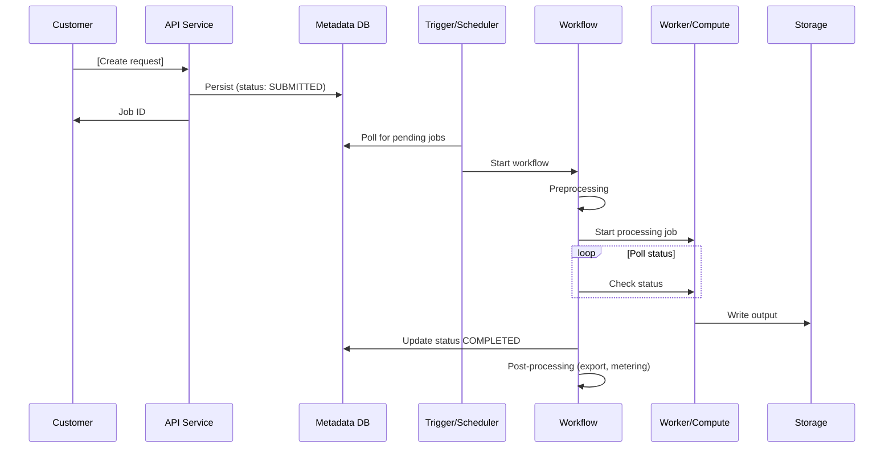

# Workflow: [WorkflowName]

This document describes the orchestration implementation for [WorkflowName]. For the overall feature architecture and account structure, see `design/features/[feature_name].md`.

> **Related**: This document contains implementation details. The high-level feature design is in `design/features/[feature_name].md`. When updating either document, ensure the other stays consistent.

**Table of Contents**:
1. [Overview](#overview) — State machines, timeouts
2. [Trigger Mechanism](#trigger-mechanism) — How the workflow is started
3. [Happy Path](#happy-path) — End-to-end step sequence
4. [Stop/Cancel Flow](#stopcancel-flow) — Cancellation handling and race conditions
5. [Error Handling Strategy](#error-handling-strategy) — Retries, DLQs, failure handlers
6. [Code References](#code-references)

## Overview

The workflow is implemented as [number] state machines:

| State Machine | Timeout | Purpose |
|--------------|---------|---------|
| [WorkflowName] | [e.g., 7 days] | [Parent orchestrator for the full lifecycle] |
| [SubWorkflow1] | [e.g., 167 hrs] | [Sub-workflow for phase 1] |
| [SubWorkflow2] | [e.g., 168 hrs] | [Sub-workflow for phase 2] |
| [PostProcessing] | [e.g., 3 hrs] | [Cleanup, export, metering] |
| [StopWorkflow] | [e.g., 3 days] | [Customer-initiated stop] |

## Trigger Mechanism

```
[Source System]                        [Workflow Account]
┌─────────────────────┐              ┌──────────────────────────────────┐
│ [Event source]       │              │                                  │
│         │            │              │  [Queue / Trigger]               │
│         ▼            │              │         │                        │
│ [Event publish]      │──[method]──▶│         ▼                        │
│                      │              │  [Starter Lambda]                │
│                      │              │         │                        │
│                      │              │         ▼                        │
│                      │              │  Routes to appropriate workflow  │
│                      │              │                                  │
│                      │              │  DLQ: [DLQ name]                 │
│                      │              │  (max [N] retries, [N]-day ret.) │
└─────────────────────┘              └──────────────────────────────────┘
```

The starter Lambda:
1. [Step 1: e.g., Receives event, extracts job ID]
2. [Step 2: e.g., Describes job from metadata service]
3. [Step 3: e.g., Builds workflow context]
4. [Step 4: e.g., Routes to start or stop workflow based on status]

## Happy Path

### End-to-End Sequence Diagram



### [Main Workflow Name]

Parent orchestrator that sequences preprocessing, sub-workflows, and post-processing with stop-check gates between each phase.

```
[PreprocessingTask]
  │
  ├─ statusCode != 200 ──────────────────────────────────┐
  │                                                       │
  ▼                                                       │
[CheckStop] ──(stopped)──▶ [PopulateStoppedResult] ──┐   │
  │                                                   │   │
  ▼                                                   │   │
[Sub-Workflow 1]                                      │   │
  │                                                   │   │
  ├─ statusCode=400 ──▶ [PopulateFailedResult] ──────┤   │
  │                                                   │   │
  ▼                                                   │   │
[CheckStop] ──(stopped)──▶ [PopulateStoppedResult] ──┤   │
  │                                                   │   │
  ▼                                                   │   │
[Sub-Workflow 2]                                      │   │
  │                                                   │   │
  ├─ statusCode=400 ──▶ [PopulateFailedResult] ──────┤   │
  │                                                   │   │
  ▼                                                   │   │
[PopulateCompletedResult] ────────────────────────────┤   │
                                                      │   │
                                                      ▼   │
                                            [PostProcessing]◀──┘
                                                      │
                                                      ▼
                                            [EmitBusinessMetrics]
                                                      │
                                                      ▼
                                            [CheckIfISE] → Succeed/Fail
```

Error handling: Any unhandled exception triggers [error transform] which routes to [PostProcessing] to ensure cleanup always runs.

### Task Reference

| Task | Handler/Function | Purpose |
|------|-----------------|---------|
| [PreprocessingTask] | [handler path] | [Validate permissions, compute paths, update status] |
| [CheckStopTask] | [handler path] | [Query metadata to check if customer requested stop] |
| [SubWorkflow1Task] | [handler path] | [Start processing job, poll until complete] |
| [SubWorkflow2Task] | [handler path] | [Start secondary job, poll until complete] |
| [PostProcessingTask] | [handler path] | [Export output, update status, publish metering] |
| [EmitMetricsTask] | [handler path] | [Write business metrics] |

### [Sub-Workflow 1: e.g., Data Processing]

```
[InitContext]
  │
  ▼
[ValidateAccess] ──(fail)──▶ [ProcessResults]
  │
  ▼
[CreateKmsGrant] ──(fail)──▶ [RetireKmsGrant]
  │
  ▼
[StartJob] ──(fail)──▶ [RetireKmsGrant]
  │
  ▼
┌──▶ [Wait N minutes]
│       │
│       ▼
│   [DescribeJob] ──(fail)──▶ [Cleanup]
│       │
│       ├─ InProgress ──▶ (loop back)
│       └─ Terminal ────▶ [Cleanup]
└───────┘
              │
              ▼
        [RetireKmsGrant]
              │
              ▼
        [ProcessResults]
              │
              ▼
        [CheckIfISE] → Succeed/Fail
```

Key details:
- Timeout: [N hours]
- Poll interval: [N minutes]
- Cleanup wait: [N minutes for resource cleanup, e.g., ENI cleanup]
- KMS grants: [Which roles get grants]

### [Sub-Workflow 2: e.g., Training/Secondary Processing]

```
[InitContext]
  │
  ▼
[PopulateAttributes] ──(fail)──▶ [ProcessResults]
  │
  ▼
[CreateKmsGrant] ──(fail)──▶ [RetireKmsGrant]
  │
  ▼
[StartJob] ──(fail)──▶ [RetireKmsGrant]
  │
  ▼
┌──▶ [Wait N minutes]
│       │
│       ▼
│   [DescribeJob]
│       │
│       ├─ InProgress ──▶ (loop back)
│       ├─ Failed + retryable + retries < [max]
│       │     ──▶ [StartJob] (retry)
│       ├─ Failed (non-retryable) ──▶ [RetireKmsGrant]
│       ├─ Completed ──▶ [RetireKmsGrant]
│       └─ Stopped ────▶ [RetireKmsGrant]
└───────┘
              │
              ▼
        [ProcessResults]
```

Key details:
- Timeout: [N hours]
- Retry: up to [N] retries on retryable failures
- Uses [escalating backoff / fixed interval] retry strategy

### [Post-Processing Workflow]

Always runs — even on failure or stop — to ensure consistent state.

```
[CheckSubWorkflowStatus] (executionStatus == Completed?)
  │
  ├─ Yes: [CreateKmsGrant]
  │         │
  │         ▼
  │       [ExportOutput] ──(fail)──▶ [TransformError]
  │         │
  └─ No: ──▶ [UpdateStatus] ◀───────┘
              │
              ▼
        [UpdateJob] ──(fail)──▶ [TransformError]
              │
              ▼
        [MeteringTask] ──(fail)──▶ [TransformError]
              │
              ▼
        [RetireKmsGrant]
              │
              ▼
        [UpdateExecutionMetadata]
```

Key details:
- Timeout: [N hours]
- Export only runs on successful completion
- Metering and status update always run
- Two error transform paths for different failure stages

## Stop/Cancel Flow

### State Tracking

The [ExecutionMetadata / State Table] tracks workflow state and is critical for the stop flow:

- **Table:** [Table name]
- **Key:** [Partition key, sort key]
- **Key fields:** [ExecutionStatus, WorkflowType, sub-workflow outputs]

### How Stop Determines What to Stop

```
[StopDecider]:
  │
  ├─ State record doesn't exist yet
  │     → Retry (start workflow hasn't initialized)
  │
  ├─ No sub-workflows recorded
  │     → Stop sub-workflow 1 (it's running or hasn't started)
  │
  ├─ Sub-workflow 1 done, sub-workflow 2 not done
  │     → Stop sub-workflow 2
  │
  └─ Both sub-workflows done
        → Nothing to stop (post-processing will handle)
```

### Stop Workflow State Machine

```
[StopDecider] (extended retry: [N] attempts, ~[N] min)
  │
  ▼
[ShouldCallPostProcessing?]
  │
  ├─ Yes: [PostProcessingWorkflow] → Succeed
  │
  └─ No: [StopDeciderChoice]
           │
           ├─ Stop sub-workflow 1 → [StopJob1Task] → Succeed
           ├─ Stop sub-workflow 2 → [StopJob2Task] → Succeed
           └─ Nothing to stop → Succeed
```

### Race Conditions Handled

| Race Condition | How It's Handled |
|---------------|-----------------|
| [Stop before start initializes] | [Retry with backoff until state record appears] |
| [Stop between sub-workflows] | [State table tracks which sub-workflow is active] |
| [Stop after workflow finished but before post-processing] | [Stop workflow triggers post-processing] |
| [Stop after post-processing already ran] | [No-op, succeed] |

## Error Handling Strategy

| Mechanism | Scope | Behavior |
|-----------|-------|----------|
| [Lambda retry] | Per task | [Retry on retryable exceptions, transient errors] |
| [Escalating backoff] | [Specific task] | [Longer backoff for specific operations] |
| [Extended retry] | [Stop decider] | [[N] retries over ~[N] min for race conditions] |
| [Job retry] | [Sub-workflow 2] | [Up to [N] new jobs on retryable failure] |
| [TransformError] | [Parent workflow] | [Catches unhandled errors, routes to post-processing] |
| [CheckIfISE] | [All sub-workflows] | [Routes 5xx to Fail, 4xx to Succeed (customer error)] |
| [EventBridge failure rule] | [Parent workflow] | [On FAILED status, triggers failure handler] |
| [DLQ] | [Trigger queue] | [Messages failing [N] times go to DLQ] |

## Metering Flow

```
[Processing Component]              [Storage]                    [Metering Lambda]
┌──────────────────────┐                                        ┌─────────────────┐
│ 1. Process work      │                                        │                 │
│ 2. Generate usage    │──write usage records──▶ [Storage]      │                 │
│    records           │                                        │ 3. Read records  │
└──────────────────────┘                                        │ 4. Aggregate     │
                                                                │ 5. Publish to    │
                                                                │    metering svc  │
                                                                └─────────────────┘
```

### Metering Record Types

| Record Type | Source | Published By | Unit | Notes |
|------------|--------|-------------|------|-------|
| [Usage type 1] | [Where it comes from] | [Which task publishes] | [Unit of measure] | |
| [Usage type 2] | [Where it comes from] | [Which task publishes] | [Unit of measure] | |

## Operational Reference

### State Machines

| State Machine | Naming Pattern |
|--------------|---------------|
| [Workflow 1] | [NamingPattern-{region}-{stage}] |
| [Workflow 2] | [NamingPattern-{region}-{stage}] |

### Key Log Groups

| Log Group | Purpose |
|-----------|---------|
| [/aws/lambda/HandlerName] | [What to look for here] |
| [/aws/lambda/HandlerName] | [What to look for here] |

### Key Alarms

| Alarm | Severity | Condition |
|-------|----------|-----------|
| [AlarmName] | Critical | [Threshold] |
| [AlarmName] | Warning | [Threshold] |

## Code References

| Component | Package | Key Files |
|-----------|---------|-----------|
| [Workflow CDK] | [PackageName] | [Key file paths] |
| [Lambda handlers] | [PackageName] | [Key file paths] |
| [Shared utilities] | [PackageName] | [Key file paths] |
| [Trigger/Scheduler] | [PackageName] | [Key file paths] |
| [Error processing] | [PackageName] | [Key file paths] |
